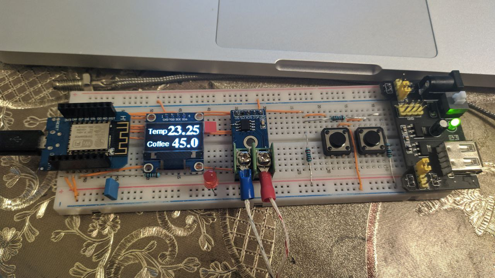
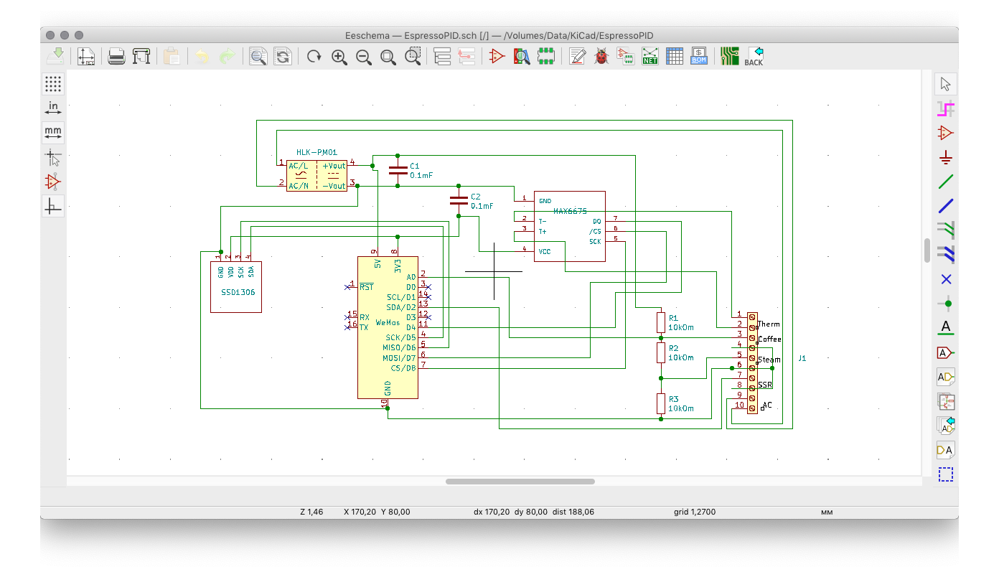

## Espresso PID Controller
PID controller being used on a pre-2015 Gaggia Classic boiler

The slow responding and somewhat innacturate bimetal coffee thermostat is replaced with a K type thermocouple
connected to an Arduino controller that controls a Solid State Relay (SSR) to control power to the small boiler inside
the espresso machine.

## Current file
Use [controller-iotwebconf.ino](https://github.com/shmick/Espresso-PID-Controller/blob/master/controller-iotwebconf.ino)

## Parts used
#### ~~Inexpensive Arduino Nano v3 from eBay/Amazon~~
#### Wemos D1 Mini from eBay/Amazon
#### AD8495 Thermocouple amp from [Adafruit](https://www.adafruit.com/product/1778)
#### K Type thermocouple from a QIDI 3D printer with M4 threads from [eBay](https://www.ebay.ca/itm/QIDI-TECHNOLOGY-high-quality-thermocouple-sensor-for-3d-printer-Screw-thread-M4/332233484894)
#### ADS1115 15bit ADC to provide better temperature resolution
#### Inexpensive (~ $15) Solid State Relay from eBay/Amazon
#### I2C 128x64 OLED display from eBay/Amazon 

===================================================

# Changed
## Parts used for the prototyping

1. Wemos D1 Mini
1. K Type thermocouple with M4 threads
1. I2C 128x64 OLED SSD1306 display
1. Max6675 Temperature Sensor Module
1. 10k ohm resistor 4 pcs
1. 0.1mF capacitor 2 pcs
1. Buttons 2 pcs
1. Led 1 pcs
1. Breadboard
1. Wires

## Eeschema 
