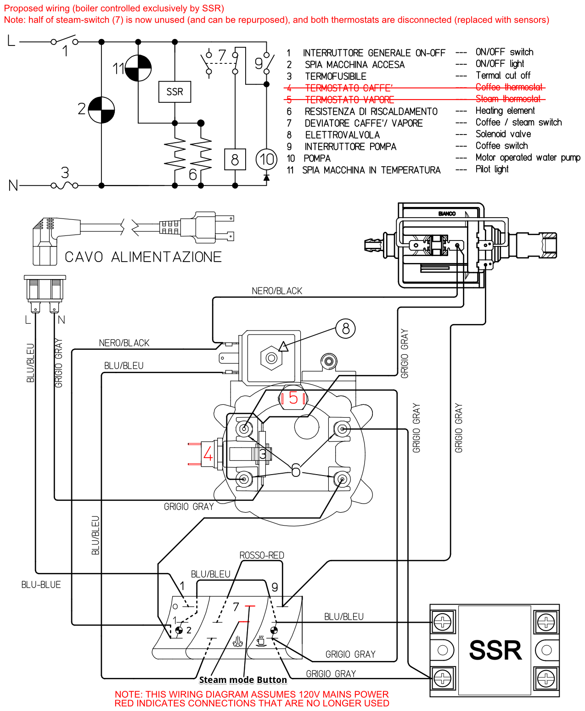

## Espresso PID Controller

### Features:
* PID temperature control
* OTA firmware update
* MQTT server interaction (setting up temperatures and monitoring data)
* 2 temperature modes (using genuine gaggia coffee/steam switch)

## Parts used for the prototyping

1. Wemos D1 Mini
1. K Type thermocouple with M4 threads
1. I2C 128x64 OLED SSD1306 display
1. Max6675 Temperature Sensor Module
1. 10k ohm resistor (4 pcs)
1. Buttons (2 pcs)
1. Led (1 pcs)
1. Breadboard
1. Wires

## Parts needed for the PID controller
1. Wemos D1 Mini
1. K Type thermocouple with M4 threads
1. I2C 128x64 OLED SSD1306 display
1. MAX6675 SMD 8-SOIC (0.154", 3.90mm Width)
1. 10k ohm resistor (3 pcs)
1. 0.1mF capacitor (2 pcs)
1. PCB board or universal printed circuit protoboard
1. Wires
2. HLK-PM01 AC/DC converter
3. PCB mount screw terminal block connectors 5.00mm (5 pcs)
4. DC-AC SSR relay

## Eeschema 

## PCB
Download [EspressoPID.zip](./files/EspressoPID.zip) file with GBR files in it.

###### PCB design

###### PCB board

###### PCB board with SSR installed

###### Wiring diagram

###### Everything is connected

## Final result

###### MQTT control pane

###### Display housing (will be reprinted with black colour plastic)

###### Upgraded coffee mashine

Download [3dFiles.zip](./files/3dFiles.zip) STL files to print OLED housing .
 
