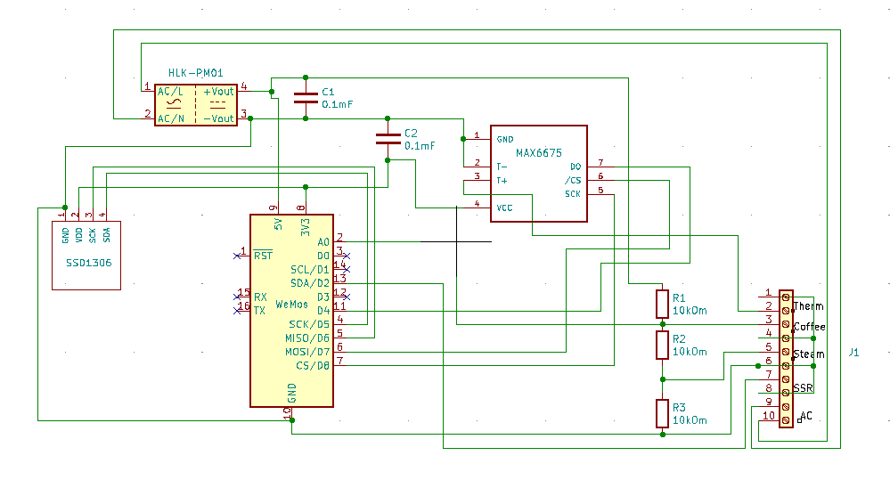
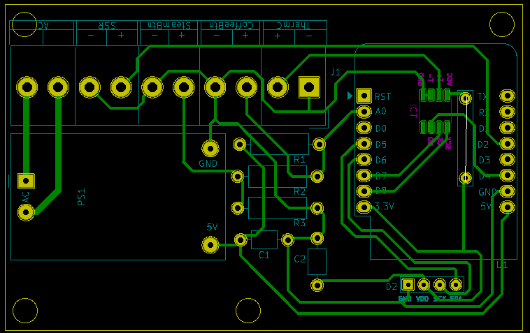

## Espresso PID Controller
PID controller being used on a pre-2015 Gaggia Classic boiler

The slow responding and somewhat innacturate bimetal coffee thermostat is replaced with a K type thermocouple
connected to an Arduino controller that controls a Solid State Relay (SSR) to control power to the small boiler inside the espresso machine.

## Parts used for the prototyping

1. Wemos D1 Mini
1. K Type thermocouple with M4 threads
1. I2C 128x64 OLED SSD1306 display
1. Max6675 Temperature Sensor Module
1. 10k ohm resistor (4 pcs)
1. Buttons (2 pcs)
1. Led (1 pcs)
1. Breadboard
1. Wires

## Eeschema 

## PCB
Download [EspressoPID.zip](./files/EspressoPID.zip) file with GBR files in it.

## Parts needed for the PID controller
1. Wemos D1 Mini
1. K Type thermocouple with M4 threads
1. I2C 128x64 OLED SSD1306 display
1. MAX6675 SMD 8-SOIC (0.154", 3.90mm Width)
1. 10k ohm resistor (3 pcs)
1. 0.1mF capacitor (2 pcs)
1. Buttons 2 pcs
1. PCB board or universal printed circuit protoboard
1. Wires
2. HLK-PM01 AC/DC converter
3. PCB mount screw terminal block connectors 5.00mm (5 pcs)
 